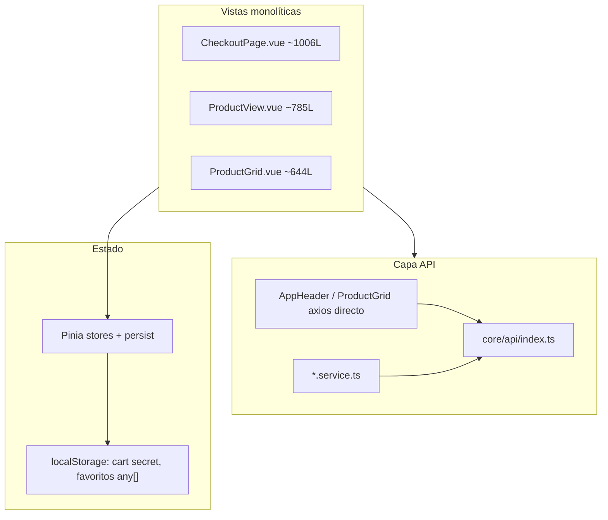

# Reporte de Auditoría Estática — frontend-ecommerce

**Fecha de referencia:** Mayo 2026  
**Alcance:** `src/` — Vue 3.5, Pinia 3, Vue Router 4.6, Axios/Strapi, Tailwind 4, TypeScript 6  
**Metodología:** Revisión estática de SFC, stores, router, servicios y composables. Sin cambios de código.

---

## Resumen ejecutivo

| Área | Estado general |
|------|----------------|
| Vue 3 / script setup | 44/44 SFC con `<script setup>` |
| Composables | Solo 2 archivos; lógica duplicada en vistas grandes |
| Pinia | Acciones usadas correctamente en vistas; refs mutables expuestas |
| Router | Lazy loading en rutas top-level; sin guards globales |
| API Strapi | Capa de servicios presente pero incompleta; lógica de checkout en `core/api` |
| Tests | **0** archivos de test en el repositorio |
| TypeScript | Sin `@ts-ignore`; concentración de `any` en grid y favoritos |

---

## Plan de acción semanal

| Día | Foco | Prioridad |
|-----|------|-----------|
| **Lunes** | Seguridad (XSS mapa, `clientSecret` en persist), `CheckoutSuccess` (fetch/timers), sanitización | Alta |
| **Martes** | Condiciones de carrera: envío checkout, verificación de orden, abort/cleanup lifecycle | Alta |
| **Miércoles** | Extraer composables y servicios; reducir `CheckoutPage` / `ProductGrid` | Media |
| **Jueves** | Pinia (`readonly`, persist selectivo), router/query helpers, interceptor de errores UX | Media |
| **Viernes** | Tipado `any`, logs de depuración, consistencia markdown/Tailwind, tests smoke | Baja + cimientos |

### Checklist por día

- [ ] **Lunes:** SharedMap XSS, quitar `clientSecret` de persist, `CheckoutSuccess` fetch + timers
- [ ] **Martes:** Unificar watchers CP checkout, requestId en envío, `onUnmounted` Stripe/ProductView/Success
- [ ] **Miércoles:** Extraer composables checkout; `useProductPricing`; mover axios del header/grid a servicios
- [ ] **Jueves:** persist selectivo `storeView`, `readonly` stores, `useRouteQueryFilters`, interceptor UX errores
- [ ] **Viernes:** Reducir `any`, unificar markdown, quitar logs, tests smoke cart/checkout

---

## Prioridad Alta

*Bugs críticos, cuellos de botella de rendimiento, vulnerabilidades.*

### Seguridad y datos sensibles

- **[src/features/shared-components/SharedMap.vue](src/features/shared-components/SharedMap.vue)** (líneas 17–20, 47–49) — `v-html` con `iframeRaw` del CMS sin DOMPurify — Si Strapi se compromete o un editor inserta script/event handlers, hay riesgo XSS. Los demás `v-html` del proyecto pasan por DOMPurify/markdown sanitizado.

- **[src/features/cart/stores/cart.store.ts](src/features/cart/stores/cart.store.ts)** (líneas 133–136, persist `pick`) — Persiste `activeClientSecret` y `activeOrderDocumentId` en `localStorage` — Un PaymentIntent secret en almacenamiento del cliente expira mal, es visible en DevTools y puede quedar huérfano tras abandonar checkout.

- **[src/features/checkout/views/CheckoutSuccess.vue](src/features/checkout/views/CheckoutSuccess.vue)** (líneas 75–78) — `fetch` a `/orders/:id` sin comprobar `response.ok` ni tipar la respuesta — Errores HTTP 4xx/5xx se interpretan como JSON válido; la UI puede avanzar a estados incorrectos.

### Bugs críticos y condiciones de carrera

- **[src/features/checkout/views/CheckoutSuccess.vue](src/features/checkout/views/CheckoutSuccess.vue)** (líneas 89–124, 149–158) — `setTimeout(verifyOrder, 2000)` recursivo sin `onUnmounted` — Al salir de la ruta, los reintentos pueden seguir mutando estado y llamando al API.

- **[src/features/checkout/views/CheckoutPage.vue](src/features/checkout/views/CheckoutPage.vue)** (líneas 445–463 y 692–709) — Dos watchers disparan `handleZipCodeChange()` para el mismo CP — Doble cotización de envío, estados inconsistentes y carga innecesaria al backend.

- **[src/features/checkout/views/CheckoutPage.vue](src/features/checkout/views/CheckoutPage.vue)** (líneas 390–415) — `shippingService.getEstimate` sin guard de “última petición ganadora” — Si el usuario cambia CP rápido, una respuesta antigua puede sobrescribir tarifas actuales (el header sí usa `searchRequestId` en búsqueda).

- **[src/features/store-view/views/StoreViewPage.vue](src/features/store-view/views/StoreViewPage.vue)** (líneas 62–72) — `onMounted` y `watch(route.query, { immediate: true })` aplican filtros dos veces al montar — `ProductGrid` puede hacer fetch duplicado.

- **[src/features/checkout/components/PaymentDetails.vue](src/features/checkout/components/PaymentDetails.vue)** (líneas 34–43, 82–88) — Stripe Elements sin cleanup en `onUnmounted` — Fugas de listeners/DOM al abandonar checkout o cambiar `clientSecret`.

- **[src/features/products/views/ProductView.vue](src/features/products/views/ProductView.vue)** (líneas 414–447) — `setTimeout` para `linkJustCopied` sin limpieza en `onUnmounted` — Actualización de estado tras desmontar la ficha.

### Rendimiento / cuellos de botella

- **[src/features/checkout/views/CheckoutPage.vue](src/features/checkout/views/CheckoutPage.vue)** (~1006 líneas) — Monolito con formulario, Envíoclick, envío gratis/local, prefetch Stripe, transferencia y UI — Alto costo de regresión en cada cambio de checkout.

- **[src/features/store-view/components/ProductGrid.vue](src/features/store-view/components/ProductGrid.vue)** (líneas 330–337, ~644 líneas) — `watch(appliedProductFilters)` dispara `fetchAllProducts()` sin debounce — Cada cambio de query/filtros genera request completo a Strapi.

- **[src/features/header/components/AppHeader.vue](src/features/header/components/AppHeader.vue)** (líneas 54–62) — `api.get('/products')` embebido en el header — Acopla navegación global al contrato Strapi; sin capa de servicio ni caché.

### Ausencia de red de seguridad

- **`src/`** (proyecto completo) — 0 tests (`*.spec.*`, `*.test.*`) — No hay regresión automática en checkout, carrito, filtros ni rutas dinámicas.

---

## Prioridad Media

*Refactorizaciones, deuda técnica, abstracción de composables.*

### Arquitectura de componentes y composables

- **[src/features/checkout/views/CheckoutPage.vue](src/features/checkout/views/CheckoutPage.vue)** — Separar en composables (`useCheckoutShipping`, `useCheckoutPayment`, `useCheckoutFormValidation`) — Reduce acoplamiento y permite probar envío/pago aisladamente.

- **[src/features/products/views/ProductView.vue](src/features/products/views/ProductView.vue)** (~785 líneas) — Variantes, galería, carrito, favoritos y share en una vista — `useProduct` solo cubre carga básica.

- **[src/features/store-view/components/ProductGrid.vue](src/features/store-view/components/ProductGrid.vue)** — Duplica lógica de precio/stock de `useProduct.ts` (líneas 114–163 vs grid 116–257) con `any` — Un `useProductPricing` unificaría reglas de negocio.

- **[src/features/blog/composables/useBlogFilter.ts](src/features/blog/composables/useBlogFilter.ts)** (línea 4) — `selectedCategory` es ref a nivel de módulo — Todas las instancias comparten estado.

- **[src/features/routing/views/DynamicPageView.vue](src/features/routing/views/DynamicPageView.vue)**, [StoreViewPage.vue](src/features/store-view/views/StoreViewPage.vue), [HomePage.vue](src/features/home/views/HomePage.vue), [BlogListView.vue](src/features/blog/views/BlogListView.vue) — Patrón `componentMap` + `defineAsyncComponent` repetido 4 veces — Candidato a `useStrapiDynamicZone()` compartido.

### Props / emits / slots

- **[src/dev/DevAddressSeeder.vue](src/dev/DevAddressSeeder.vue)** (línea 4) — `defineEmits(['select-address'])` sin tipado TypeScript — Único emit sin contrato tipado.

- **[src/features/checkout/components/ShippingAddressSection.vue](src/features/checkout/components/ShippingAddressSection.vue)** (línea 25) — Mutación en setup: `model.value.country = 'México'` — Efecto lateral sobre el modelo del padre.

### Gestión de estado (Pinia)

- **[src/features/store-view/stores/storeView.store.ts](src/features/store-view/stores/storeView.store.ts)** (líneas 61–72) — `persist: true` persiste `loading`, `error`, `currentSortBy` y filtros — Estado transitorio reaparece tras recargar.

- **[src/features/store-view/stores/storeView.store.ts](src/features/store-view/stores/storeView.store.ts)** (líneas 29–38) — `fetchPage` ejecuta `router.replace` — Mezcla datos con navegación.

- **[src/features/cart/stores/cart.store.ts](src/features/cart/stores/cart.store.ts)** (líneas 114–132) — Expone refs sin `readonly()` — API del store frágil ante mutaciones accidentales.

- **[src/features/favorites/store/favorites.store.ts](src/features/favorites/store/favorites.store.ts)** (líneas 5, 13–19) — `items: any[]` persistido completo — Objetos producto enteros en localStorage; sin `clear`/`removeById`.

- **[src/features/cart/stores/cartConfig.store.ts](src/features/cart/stores/cartConfig.store.ts)** — `fetchFullCartConfig` sin estado `error` — Fallos silenciados (el servicio devuelve defaults).

### Routing

- **[src/core/router/index.ts](src/core/router/index.ts)** — Sin `beforeEach` / guards — No hay protección de checkout con carrito vacío ni manejo global de errores de navegación.

- **[src/features/header/components/AppHeader.vue](src/features/header/components/AppHeader.vue)** (línea 96) — Typo `route.path.startsWith('/chekout')` — El drawer del carrito podría no cerrarse en rutas mal escritas.

- **[src/features/store-view/views/StoreViewPage.vue](src/features/store-view/views/StoreViewPage.vue)** y **[StoreViewFilters.vue](src/features/store-view/components/StoreViewFilters.vue)** — Helpers `queryValue` / parsing duplicados.

### Integración API / Strapi

- **[src/core/api/index.ts](src/core/api/index.ts)** (líneas 22–108, 125–131) — Mezcla Axios, `shippingService`, `fetchPaymentIntent`, `updateOrderAddress` — Interceptor solo hace `console.error`; sin feedback UX.

- **[src/core/api/index.ts](src/core/api/index.ts)** (línea 98) — `addressData: any` en `updateOrderAddress` — Pierde contrato con `PaymentIntentShippingPayload`.

- **[src/features/home/services/home.service.ts](src/features/home/services/home.service.ts)** (líneas 90–95) — `console.log` de respuesta raw en producción.

- **[src/features/cart/services/cartConfig.service.ts](src/features/cart/services/cartConfig.service.ts)** (línea 317) — Log de respuesta `/api/cart-config`.

- **[src/features/header/stores/header.store.ts](src/features/header/stores/header.store.ts)** (línea 16) — `console.log('data', data)` tras fetch.

- **[src/features/footer/components/AppFooter.vue](src/features/footer/components/AppFooter.vue)** (línea 15) — Log del footer en `onMounted`.

- **Servicios Strapi** — `unwrapEntity` duplicado en header, footer, cartConfig, whatsapp.

- **[src/features/checkout/views/CheckoutSuccess.vue](src/features/checkout/views/CheckoutSuccess.vue)** vs **core/api** — Orden consultada con `fetch` nativo y URL de `shared/config/api.ts` en paralelo a Axios.

### Vue 3 — watch / computed

- **[src/features/checkout/views/CheckoutPage.vue](src/features/checkout/views/CheckoutPage.vue)** (líneas 692–709) — `deep: true` en watcher de primitivos — Re-ejecuciones innecesarias.

- **[src/features/header/components/AppHeader.vue](src/features/header/components/AppHeader.vue)** y **[CartModal.vue](src/features/cart/components/CartModal.vue)** — Watch de `document.body.style.overflow` sin `flush: 'post'`.

### Fetches sin cancelación al desmontar

- **HomePage, SlugEntryView, DynamicPageView**, etc. — `onMounted` async sin `AbortController` — No hay uso de `AbortController` en todo `src/`.

---

## Prioridad Baja

*Limpieza de código, consistencia de Tailwind, tipados estrictos faltantes.*

### TypeScript

- **[src/features/store-view/components/ProductGrid.vue](src/features/store-view/components/ProductGrid.vue)** — ~15 funciones con parámetro `any` — Alinear con `StrapiProduct`.

- **[src/features/favorites/store/favorites.store.ts](src/features/favorites/store/favorites.store.ts)** — Tipar producto mínimo (`id`, `slug`, `name`, precios).

- **[src/shared/types/index.ts](src/shared/types/index.ts)** (línea 6) — `meta: any` en `StrapiResponse`.

- **[src/features/store-view/models/index.ts](src/features/store-view/models/index.ts)** y **dtos/index.ts** — Index signatures `[key: string]: any`.

### Dependencias y markdown

- **package.json** — `marked` y `markdown-it` coexisten — Productos/checkout usan `marked`; blog usa `markdown-it` — Unificar librería y pipeline DOMPurify.

### Tailwind y UI

- **[src/features/store-view/views/StoreViewPage.vue](src/features/store-view/views/StoreViewPage.vue)** — `text-gray-500` mezclado con tokens semánticos (`on-surface-variant`).

- **[src/features/checkout/views/CheckoutPage.vue](src/features/checkout/views/CheckoutPage.vue)** (líneas 702–705) — `console.log` con emoji en flujo de envío.

### Otros

- **[src/dev/DevAddressSeeder.vue](src/dev/DevAddressSeeder.vue)** — `<script setup>` sin `lang="ts"`.

- **tsconfig.app.json** — No declara `strict` explícitamente.

- **[src/features/products/composables/useProduct.ts](src/features/products/composables/useProduct.ts)** — Solo consumido por `ProductView`.

---

## Métricas de referencia

| Métrica | Valor |
|---------|-------|
| Archivos `.vue` en `src/` | 44 |
| Composables | 2 |
| Stores Pinia | 7 |
| Usos `v-html` | 7 (1 sin sanitizar) |
| Componentes >300 líneas | 8 |
| Ocurrencias `: any` / `catch (error: any)` | ~25+ (mayoría en ProductGrid) |
| Debounce en inputs API | Solo AppHeader búsqueda (350ms) |

---

## Criterios de cierre (fin de semana)

1. `clientSecret` fuera de persist; verificación de orden con cleanup y `response.ok`.
2. Un solo watcher de CP en checkout + token de carrera en cotización de envío.
3. `SharedMap` sanitizado o restringido a whitelist de tags iframe.
4. Composable mínimo de producto pricing compartido entre grid y ficha.
5. Al menos 3–5 tests unitarios en stores críticos (cart, storeView filters) o e2e smoke de checkout.
